## Excel – юнит-экономика онлайн-кинотеатра

## Задача

Коллеги, привет! Как вы знаете, наш онлайн-кинотеатр работает по модели ежемесячной подписки. У руководства возник вопрос: насколько это эффективная система? Это значит, что нашему отделу аналитики необходимо посчитать юнит-экономику продукта и предложить сценарий по настройке параметров для выхода на 25-процентную маржинальность (это всё пойдет на слайды презентации для стратсессии в конце квартала) и собрать хорошую наглядную визуализацию, где будет показано, кто, где и в каком объеме смотрит фильмы на нашей платформе. От меня также будет просьба собрать калькулятор юнит-экономики нашего продукта, поскольку сейчас очень не хватает такой автоматизированной системы для быстрого принятия решений. 

## Решение

1.	Определение, что является юнитом в нашей экономике.

2.	Посчитана юнит-экономика продукта и предложен сценарий по настройке параметров для выхода на 25%-ную маржинальность.

3.	Выбран оптимальный вариант расчета Retention. Рассчитан Retention, Lifetime, Lifetime Revenue, CAC.

4.	Собраны визуализации основных бизнес-показателей.

5.	Исследованы данные о пользователях и их поведении.

* Как распределяются по популярности фильмы. Сколько самых популярных фильмов нужно взять, чтобы покрыть половину всех просмотров. 
* Динамика регистраций за рассматриваемый период. Построен тренд регистраций и его основе построен сформирован прогноз на ближайшие месяцы.
* Как распределяется активность в течение суток. А в течение недели. Есть ли разница между активностью в выходные дни и в будние.
* Как распределены пользователи по часовым поясам.
* Зависимость количества просмотров и даты регистрации.

Выводы по проделанной работе можно прочесть на вкладке «Выводы»  файла `Курсовая работа.xlsx`.

## Выводы

1. Исходя из предоставленных исходных данных была рассчитана юнит-экономика онлайн-кинотеатра. За юнит был взят один подписчик.

За рассматриваемый период март-август 2021 г. средний Retention составил 80,6%,  средний Lifetime 5,15 месяцев. При цене 1 месяца подписки в 350 руб. и среднем объеме скидок за рассмартиваемый период 9,33% фактическая цена 1 месяца подписки составила 317,36 руб. А средний Lifetime Revenue 1 635,57 руб. При этом средний CAC составил 2 254,52 руб. То есть на привлечение 1 пользователя мы тратили на 618,96 руб. больше, чем весь суммарный доход, который мы получаем от этого пользователя за весь его LT. В целом за рассматриваемый период одни затраты на маркетинг были больше всей выручки за тот же период.  В пересчете на юнит САС на 1 юнит составил 437,46 руб. 

По итогам рассчетов маржинальность за период с марта по август 2021 г. Была отрицательной и составила - 93,75%. 

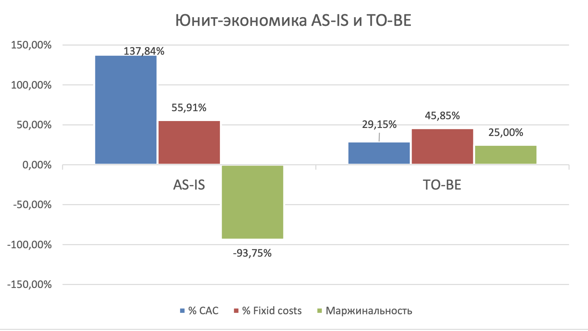

2. Кроме этого были исследованы данные о пользователях и их поведении.

Максимальное количество регистраций за рассматриваемый период было зафиксировано в апреле (5122). После этого количество регистраций стабильно снижалось. Общее количество пользователей росло до июня (10 323) за счет удержания ранее привлеченных пользователей. Однако с июля и их количество начало снижаться. 

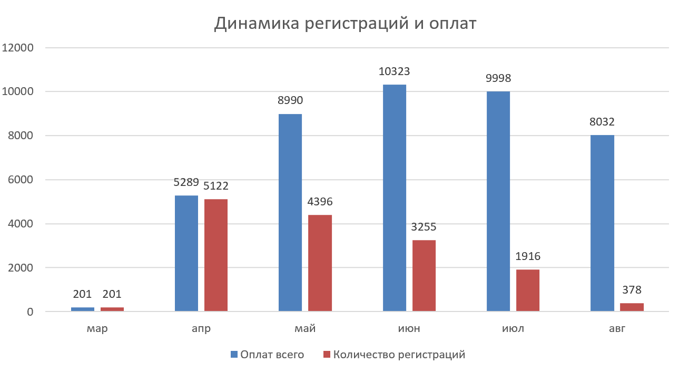

Если рассмотреть динамику количества регистраций по дням, прослежтвается тренд на снижение этого количества. Однако делать прогнозы по линии тренда динамики регистраций по дням нецелесообразно из-за низкого R^2 и, соответствено, низкой степени достоверности такого расчета.

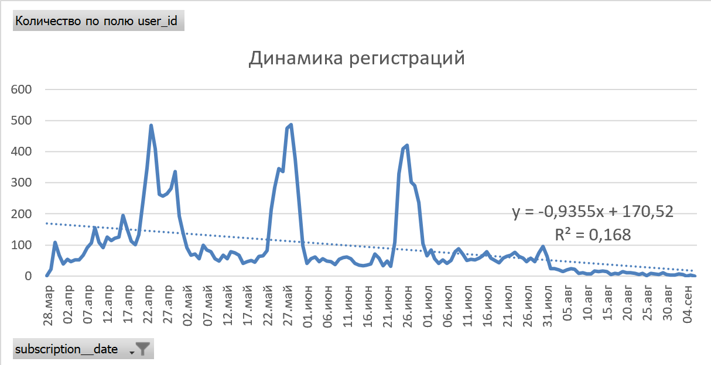

Если рассмотреть ту же динамику по месяцам, то здесь уже высокая степень достоверности расчета линии тренда (R^2 = 0,9834). Если по полученной линии тренда построить прогноз на ближайшие месяцы, то прогноз будет весьма неблагоприятным. Согласно сформированного тренда,  уже с сентября у нашего онлайн-кинотеатра не будет новых регистраций. И хоть данный вид прогноза является очень неточным, он хорошо отражает сложившуюся тенденцию. Поэтому принятие управленческих решений и смена стратегий привлечения пользователей должны быть приняты как можно скорее. Главная задача - поиск возможностей привлечения большего количества новых пользователей. 
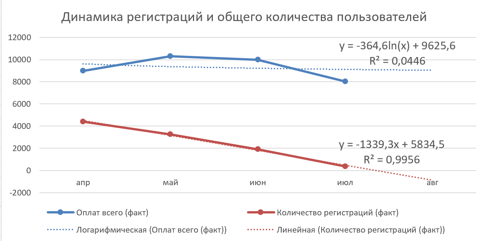

Была изучена структура пользователей.  Выявлено, что большинство подписчиков (30% от всего количества пользователей) находятся в тайм-зоне UTC+1. Следующие по популярности  зоны UTC+2 и UTC+0. Меньше всего подписчиков в зонах UTC-2 и UTC-9.

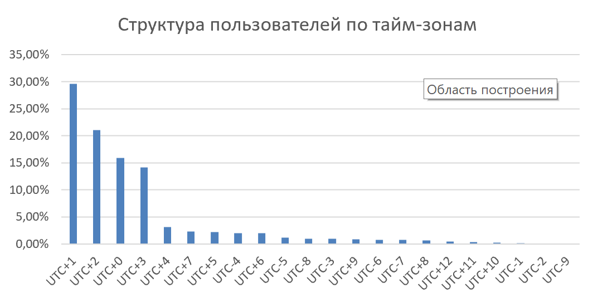

Была отслежена динамика активности просмотров фильмов по месяцам. Больше всего промсотров пришлось на июнь и июль. Из чего можно предпложить наличие сезонности. Летом многие люди уходят в отпуска и уделяют больше всемени просмотру фильмов.

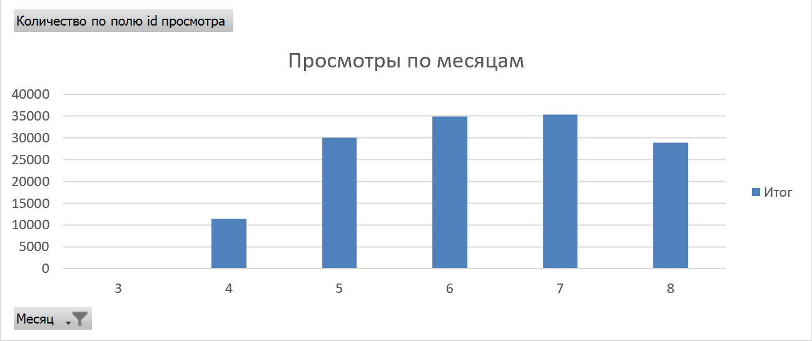

При рассмотрении активности просмотров в течение недели выявлено, что большинство просмотров приходятся на выходные дни, преимущественно на субботу. Наименьшая активность прослеживается с понедельника по четверг.

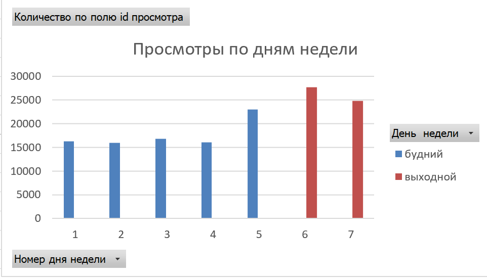

Количество просмотров в течение суток также распределено неравномерно. Наименее активный период с 3 до 11 ч. А наиболее активный период с 16 до 22. Максимальная активность прослеживается с 18 до 20 ч. 

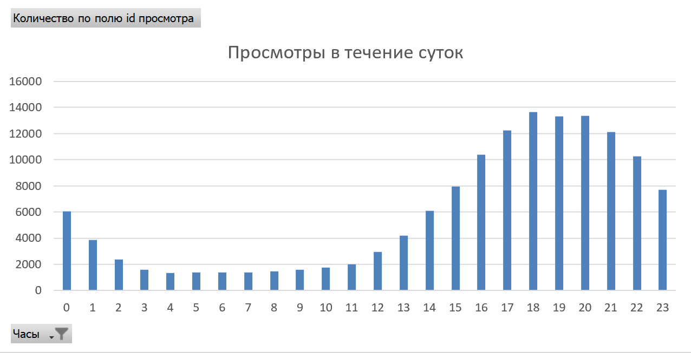

Если перевести время всех просмотров в единую тайм-зону, например в UTC+0, то прослеживается тенденция, что большинство просмотров приходится на период с 15 до 21 ч. Максимальное в период с 17 до 18 ч. А минимальное - с 3 до 7 ч по UTC+0. Соответственно, при планировании технических работ на сайте лучше использовать это время (с 3 до 7 ч по по UTC+0). И уделять внимание, чтобы сайт не "падал" особенно в период с 15 до 21 ч по UTC+0.

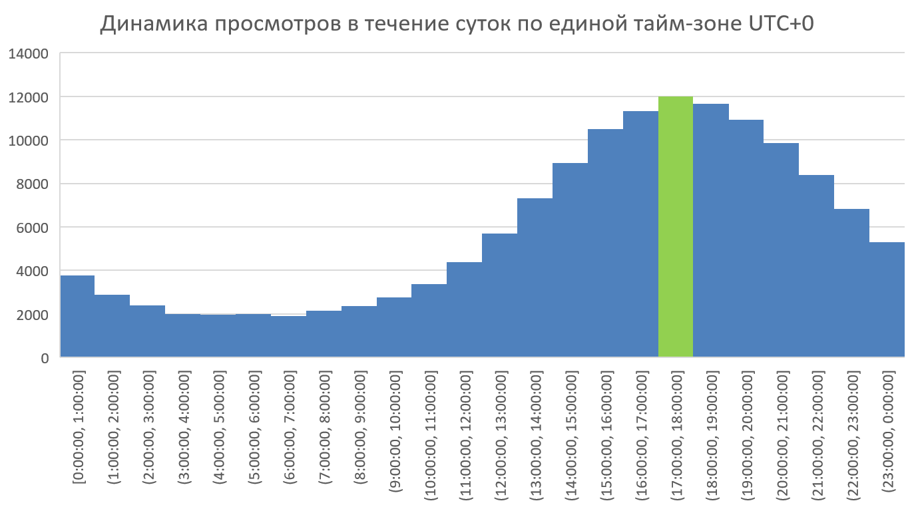

3. Была проанализирована популярность фильмов, предоставляемых нашим онлайн-кинотеатром.

Среднее количество просмотров каждого фильма 27,34. 

При этом самое часто встречаемое количество просмотров = 1

Медианный фильм имеет 5 просмотров. Половина выборки имеет менее 5 просмотров, другая половина - более 5 просмотров.

Самый популярный фильм имеет 8 071 просмотр. ID этого фильма 411922.
18% фильмов имеют лишь 1 просмотр.

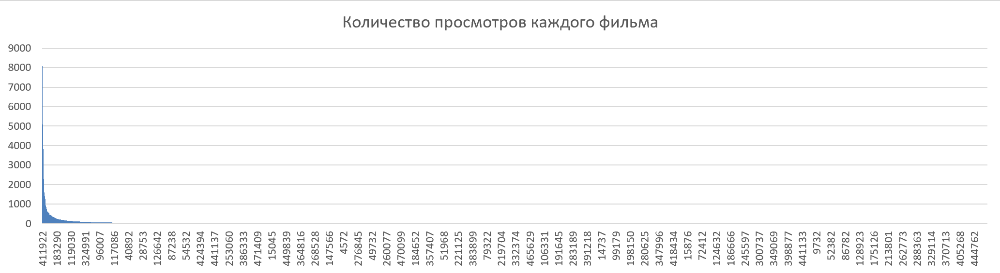

Половину всех просмотров покрывают 73 самых популярных фильма онлайн-кинотеатра
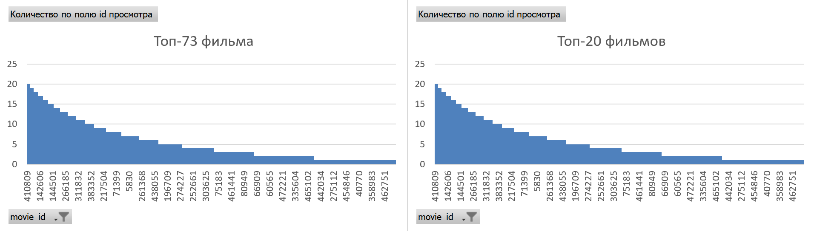

4. Была также проанализирована активность пользователей.

Среднее количество просмотров одного пользователя составило 9,71.

Медианный пользователь посмотрел за это время 9 фильмов. Половина выборки посмотрела менее 9 фильмов, другая половина - более 9.

При этом самое часто встречаемое количестро просмотров одного пользователя равно 5.

Максимальное количество просмотров одного пользователя составило 36 просмотров. ID самого активного пользователя 57578.

Всего за период с марта по август 2021 г. Всеми пользователями было совершено 140 568 просмотров.

При этом анализ показал, что  80% пользователей за все время смотрят до 15 фильмов.

Лишь 3% пользователей за все время посмотрели только 1 фильм.
59% пользователей посмотрели до 10 фильмов (включительно)

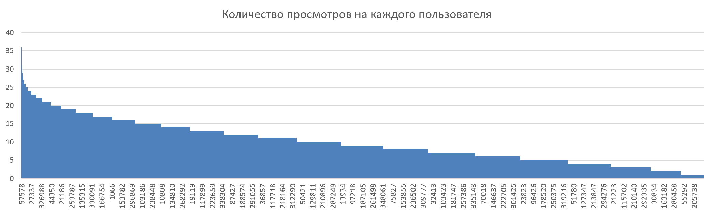

5. Была также изучена корреляция между датой регистрации и количеством просмотров. Она составила -32%. То есть наблюдается обратная зависимость между датой регистрации и количеством просмотров. Чем раньше дата регистрации, тем больше количество просмотров у данного пользователя. Однако это зависимость составила лишь 32%, что говорит о том, что эта зависимость не сильная. 

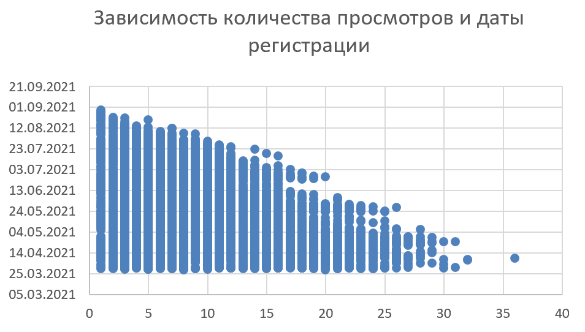



